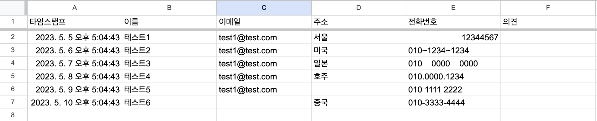
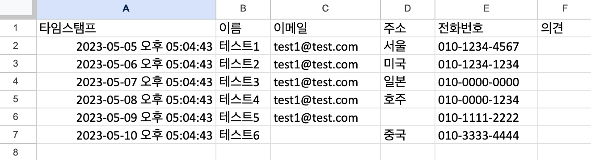

# excel_phone_number_convertor

엑셀내에 연락처를 "-" 형식으로 변환하는 애플리케이션

---
<figure>
    
</figure>
구글 폼을 이용하여 설문조사를 진행하다 보면 의도와 다른 응답을 받을 수 있다.
본 애플리케이션은 특이한 모습에 대해서 전화번호를 - 형식으로 변환한다.

--- 
샘플 
- 연락처 정보(응답).xlsx 파일
<figure>
    
</figure>

변환 후 결과(셀은 확장한 상태)
<figure>
    
</figure>

---
빌드 및 사용법

``` 
cargo build --release
```

```
excel_convertor [파일 이름] [연락처 열]
```

window
```
./excel_convertor.exe '연락처 정보(응답).xlsx' 4
```

mac
```
./excel_convertor 연락처\ 정보\(응답\).xlsx 4
```
